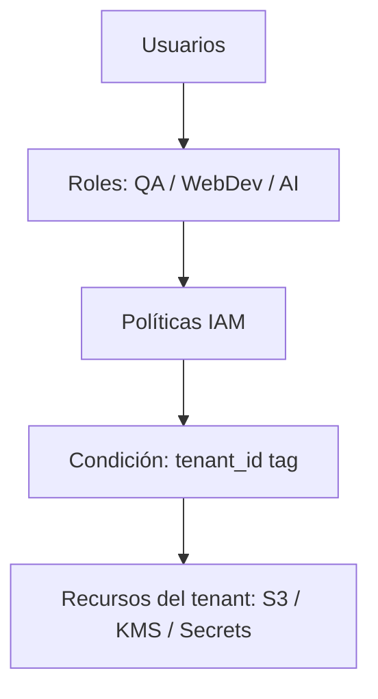
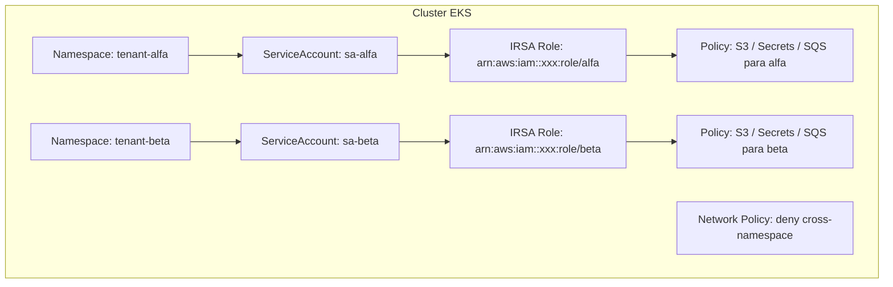
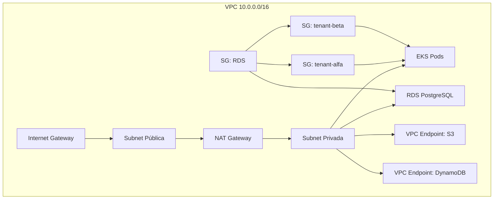
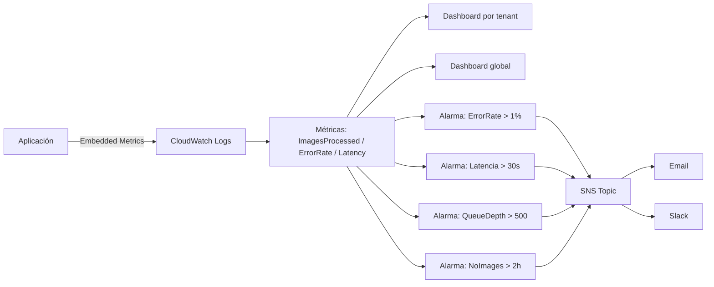

# Arquitectura Multi-Tenant en AWS

Diseño de infraestructura para plataforma multi-tenant con aislamiento por cliente, roles organizacionales (QA, WebDev, AI Engineer) y observabilidad.

---

## Descripción

1. **IAM + Roles organizacionales**: QA, WebDev y AI Engineers con permisos acotados por tenant y ambiente 
2. **EKS + IRSA**: Pods que asumen roles IAM específicos por tenant con aislamiento en red 
3. **Networking + Security Groups** Aislamiento entre tenants dentro de una misma VPC 
4. **Observabilidad**: Monitoreo de 4000 imágenes/día por cliente con alertas personalizadas 

---

## Diagramas de arquitectura

### 1. IAM + Roles por tenant



### 2. EKS + IRSA



### 3. Networking + Security Groups



### 4. Observabilidad



---

## Decisiones y tradeoffs

| Área | Decisión | Tradeoff |
|------|----------|----------|
| Cuentas AWS | Única | Simplicidad vs. aislamiento extremo |
| Seguridad | Security Group por tenant | Claridad vs. límite de 60 SGs |
| K8s permisos | IRSA | Seguro vs. setup inicial complejo |
| Métricas | Por imagen con Embedded Metrics | Detalle vs. costo a escala |

---

## Stack tecnológico

| Categoría | Tecnologías |
|-----------|-------------|
| **AWS** | IAM, EKS, VPC, RDS, S3, KMS, CloudWatch, SNS |
| **Kubernetes** | Namespaces, Network Policies, IRSA |
| **Infra as Code** | Terraform + LocalStack (validación sin costo) |
| **Base de datos** | PostgreSQL con Row Level Security (RLS) |

---

## Estructura del proyecto

```
terraform/
├── 01-multi-tenant/     # IAM + roles + S3 + KMS
├── 02-eks/              # EKS cluster + IRSA + SQS
├── 03-networking/       # VPC + Security Groups + RDS
├── 04-observability/    # CloudWatch dashboards + alarmas
└── policies/            # JSON de políticas IAM
```

---

## Validación local con LocalStack

```bash
# 1. Levantar LocalStack (emulador de AWS sin costo)
docker run -d --rm -p 4566:4566 localstack/localstack

# 2. Configurar credenciales fake
export AWS_ACCESS_KEY_ID=test
export AWS_SECRET_ACCESS_KEY=test

# 3. Validar Terraform
cd 01-multi-tenant
terraform init
terraform plan
```