# Arquitectura Multi-Tenant en AWS

Diseño de infraestructura para plataforma multi-tenant con aislamiento por cliente, roles organizacionales (QA, WebDev, AI Engineer) y observabilidad.

---

## Descripción

1. **IAM + Roles organizacionales**: QA, WebDev y AI Engineers con permisos acotados por tenant y ambiente
2. **EKS + IRSA**: Pods que asumen roles IAM específicos por tenant con aislamiento en red
3. **Networking + Security Groups**: Aislamiento entre tenants dentro de una misma VPC (ahorro consciente y simplicidad operativa)
4. **Observabilidad**: Monitoreo de 4000 imágenes/día por cliente con alertas personalizadas

---

## Diagramas de arquitectura

### 1. IAM + Roles por tenant

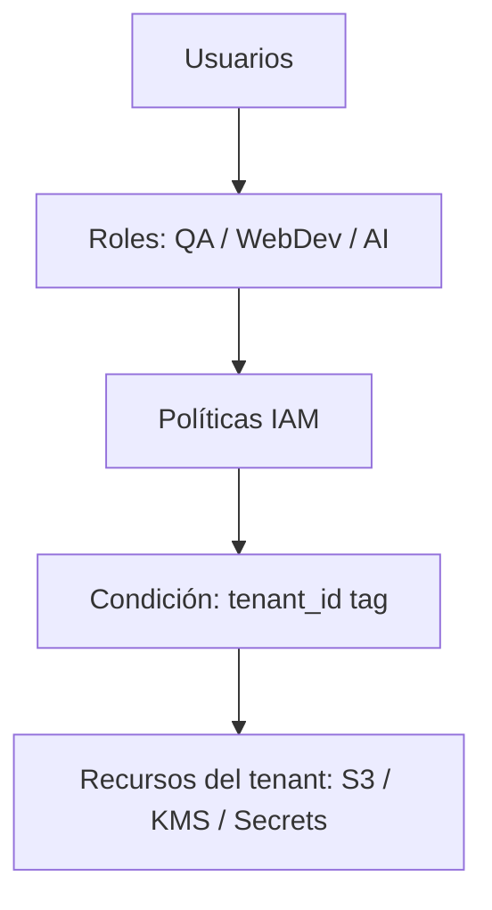

### 2. EKS + IRSA

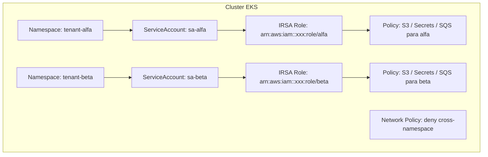

### 3. Networking + Security Groups

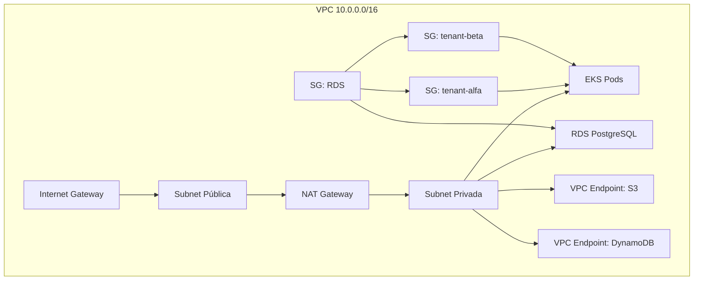

### 4. Observabilidad

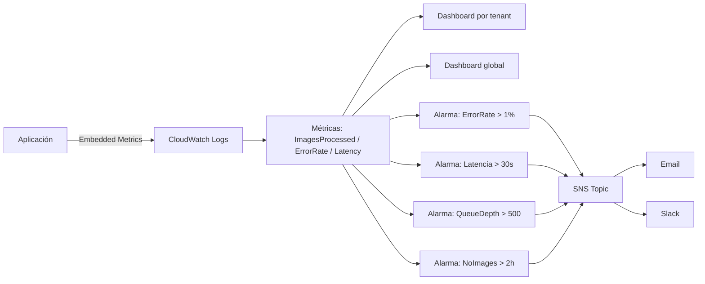

---

## Decisiones y tradeoffs

| Área | Decisión | Tradeoff |
|------|----------|----------|
| Cuentas AWS | Única | Simplicidad vs. aislamiento extremo |
| Seguridad | Security Group por tenant | Claridad vs. límite de 60 SGs |
| K8s permisos | IRSA | Seguro vs. setup inicial complejo |
| Métricas | Por imagen con Embedded Metrics | Detalle vs. costo a escala |

---

## Stack tecnológico

| Categoría | Tecnologías |
|-----------|-------------|
| **AWS** | IAM, EKS, VPC, RDS, S3, KMS, CloudWatch, SNS |
| **Kubernetes** | Namespaces, Network Policies, IRSA |
| **Infra as Code** | Terraform + LocalStack (validación sin costo) |
| **Base de datos** | PostgreSQL con Row Level Security (RLS) |

---

## Estructura del proyecto

```
terraform/
├── 01-multi-tenant/     # IAM + roles + S3 + KMS
├── 02-eks/              # EKS cluster + IRSA + SQS
├── 03-networking/       # VPC + Security Groups + RDS
├── 04-observability/    # CloudWatch dashboards + alarmas
└── policies/            # JSON de políticas IAM
```

---

## Validación local con LocalStack

```bash
# 1. Levantar LocalStack (emulador de AWS sin costo)
docker run -d --rm -p 4566:4566 localstack/localstack

# 2. Configurar credenciales fake
export AWS_ACCESS_KEY_ID=test
export AWS_SECRET_ACCESS_KEY=test

# 3. Validar Terraform
cd 01-multi-tenant
terraform init
terraform plan
```

---

## Disclaimer: Profundización del diseño (diagramas adicionales)

> Los diagramas que siguen corresponden a una **profundización del diseño original**. No reemplazan ni contradicen los diagramas anteriores. Representan el mismo diseño pero con mayor nivel de detalle en áreas específicas: IAM Conditions, EKS + IRSA mapping, Network Policies, permisos por combinación, seguridad en el pipeline (Cosign + SBOM), escalado con KEDA y observabilidad completa. A su vez, se presume un enfoque distinto respecto a quiénes utilizarán el diseño, siendo este inclinado enteramente a la iteración propia de tareas de desarrollo para los tres perfiles.

---

### 5. IAM + Condition con PrincipalTag

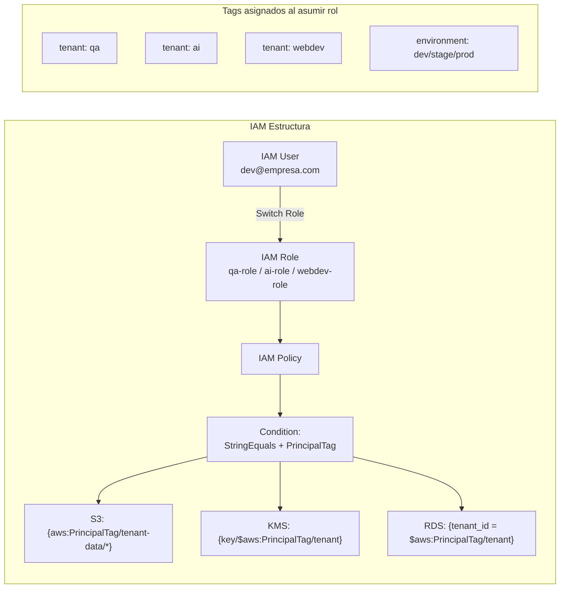
### 6. EKS + IRSA mapping detallado (tenants: qa, ai, webdev)

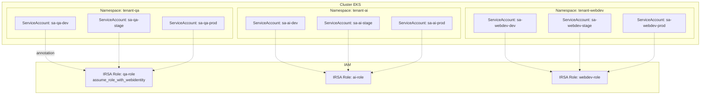

### 7. Network Policies: deny-all entre namespaces

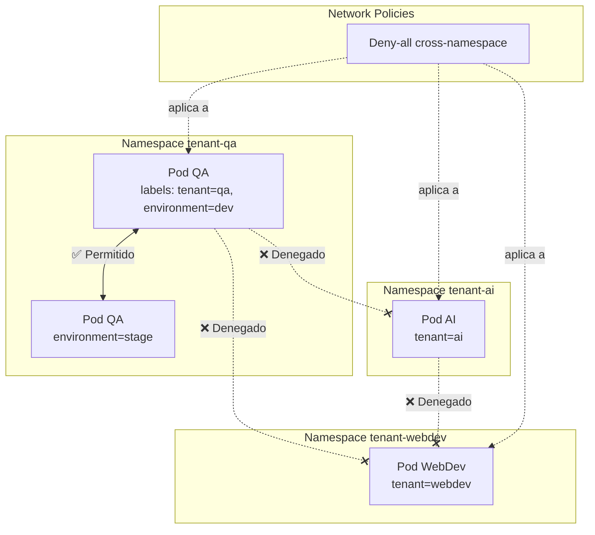

### 8. Permisos por combinación (ambiente + perfil + objeto)

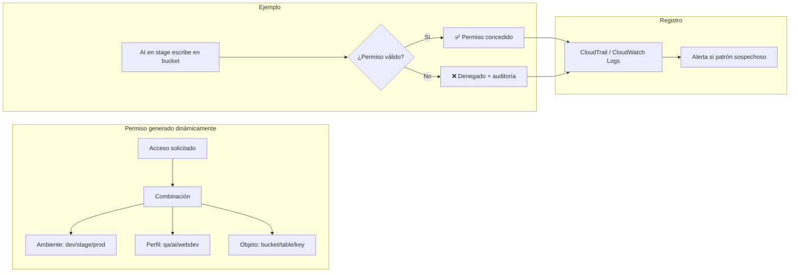

### 9. CI/CD + Seguridad en ECR (Cosign + SBOM + Kyverno)

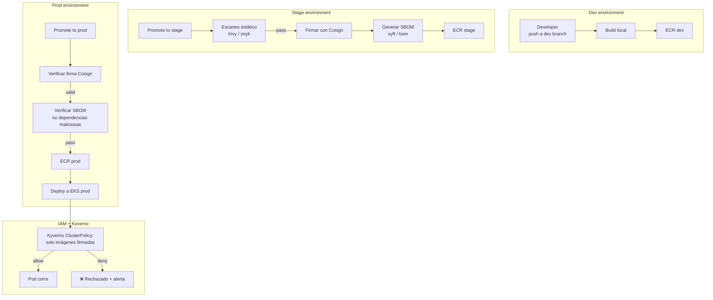

### 10. Escalado: Taints + Tolerations + KEDA

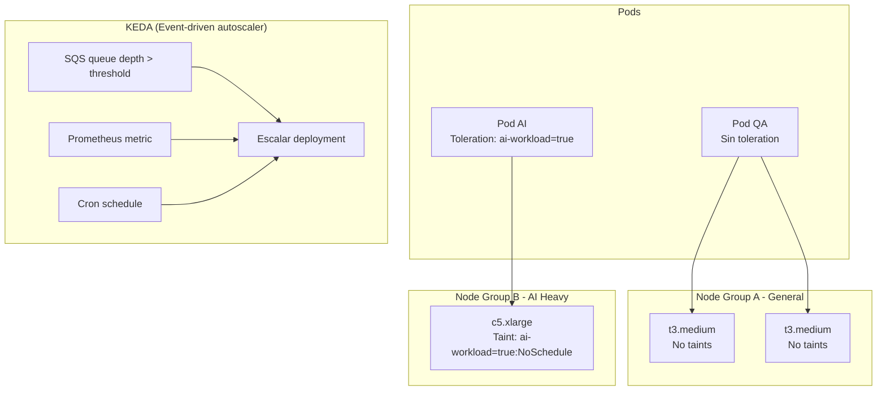

### 11. Observabilidad completa (métricas + alarmas + seguridad)

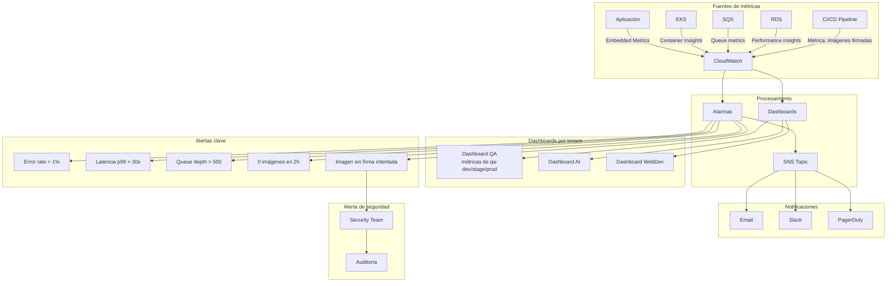

---

## Nota final

Este documento representa el diseño completo de la arquitectura multi-tenant, combinando el enfoque inicial con diagramas de profundización que detallan aspectos clave como IAM Conditions, IRSA mapping, Network Policies, seguridad en el pipeline de imágenes (Cosign + SBOM + Kyverno), escalado con KEDA (de ser preciso) y observabilidad avanzada (considerando las especificaciones de productividad requerida -4,000 imagenes/día.